# Gold Trail Tycoon – Minihry a gameplay systémy

Tento dokument obsahuje aktuálne odsúhlasené návrhy minihier a väčších gameplay systémov pre **Gold Trail Tycoon**.

Cieľom zatiaľ nie je definovať detailný balancing, presné odmeny ani technickú implementáciu. Pri každej aktivite riešime predovšetkým:

* **Kde** sa nachádza
* **Kedy** sa hráčovi sprístupní
* **Ako** funguje
* **Gameplay loop**
* **Ovládanie**
* **Prečo** dáva zmysel v Gold Trail Tycoon

---

# 1. Hry v Saloone

## Základný koncept

**Hry v Saloone** bude systém minihier dostupných prostredníctvom budovy **Saloon**.

Saloon si ponechá svoju existujúcu funkciu spojenú s výrobou **kovboji**, ale zároveň dostane druhú funkciu – možnosť hrať tematické saloonové hry.

Systém by mal byť navrhnutý tak, aby sa dal postupne rozširovať o ďalšie hry.

Potenciálna postupnosť:

**Western Dice → Farkle → Faro / Blackjack / Poker**

Vyšší úroveň Saloonu môže neskôr odomykať nové hry, vyššie stávky alebo ďalšie možnosti.

## 1.1 Western Dice

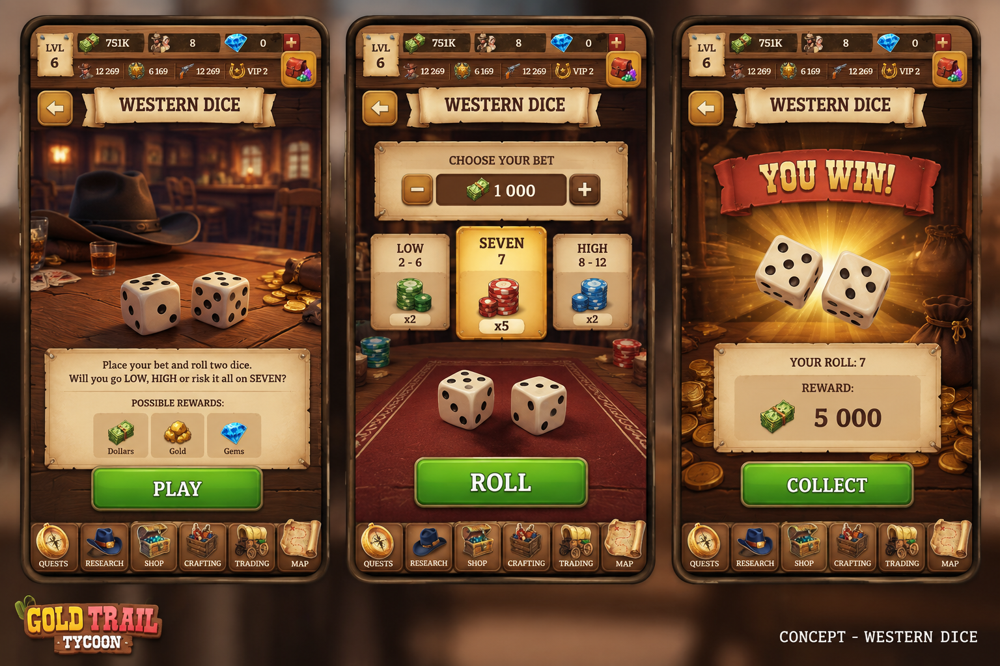

### Kde

**Saloon → Hry v Saloone → Western Dice**

### Kedy

Po odomknutí alebo postavení Saloonu.

Presná úroveň hráča zatiaľ nie je definovaná.

### Ako funguje

Hráč staví **Dollary** a vyberie:

* **LOW** – výsledok 2–6
* **SEVEN** – výsledok presne 7
* **HIGH** – výsledok 8–12

Následne hodí dvoma kockami.

LOW a HIGH predstavujú bezpečnejšie stávky s nižšou potenciálnou výhrou. SEVEN predstavuje riskantnejšiu stávku s vyššou potenciálnou výhrou.

### Gameplay

**VYBRAŤ STÁVKU → LOW / SEVEN / HIGH → HODIŤ → VÝSLEDOK → VÝHRA / PREHRA → HRAŤ ZNOVA**

### Prečo dáva zmysel

Western Dice tematicky patrí do Saloonu, vytvára ďalšie využitie Dollary a poskytuje krátky gameplay založený na riziku a odmene.

### Farkle

Farkle zostáva kandidátom na neskoršiu pokročilejšiu hra v Saloone.

---

# 2. Native Camp

## Základný koncept

Do mapy sa pridá nový interaktívny bod záujmu:

**Native Camp**

Hráč ho objaví počas prieskumu.

Native Camp nemusí mať vlastný komplexný centrum. Jeho hlavnou definovanou aktivitou je zatiaľ **Archery Challenge**.

## 2.1 Archery Challenge

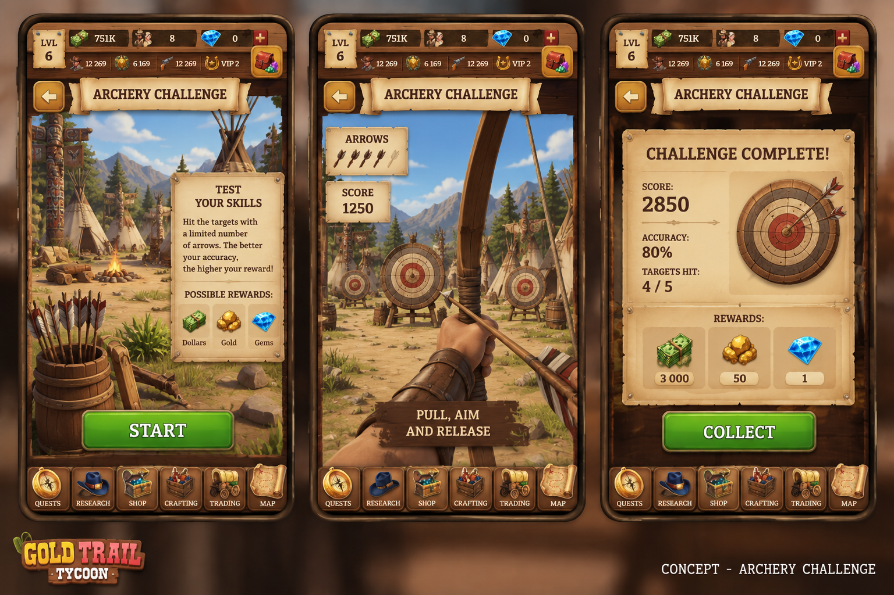

### Kde

**Native Camp**

### Kedy

Po objavení Native tábora a interakcii s NPC.

### Ako funguje

Hráč dostane obmedzený počet šípov a snaží sa dosiahnuť čo najvyššie skóre.

Neskôr sa môžu objavovať menšie, vzdialenejšie alebo pohyblivé terče.

### Ovládanie

**DOTYK → MIERIŤ / NAPNÚŤ → UVOLNIŤ PRST → VYSTRELIŤ**

Alternatíva:

**Mierenie gyroskopom + napnutie + uvoľnenie**

### Gameplay

**OBJAVIŤ NATIVE CAMP → ROZPRÁVAŤ SA S NPC → SPUSTIŤ VÝZVU → MIERIŤ → NAPNÚŤ → UVOLNIŤ → ZÁSAH → SKÓRE → ODMENA**

### Prečo dáva zmysel

**Prieskum → Native Camp → Interakcia s NPC → Zručnostná aktivita → Odmena**

---

# 3. Tábory banditov a stretnutia s banditmi

## Základný koncept

Banditi nebudú predstavovať iba jednorazový bojové stretnutie.

Obsah s banditmi môže obsahovať:

**Tábor banditov → Vyčistený tábor banditov → Knife Throwing**

a ďalšie stretnutia ako:

**Safe Cracking → Quick Draw → Combat**

---

## 3.1 Vyčistený tábor banditov

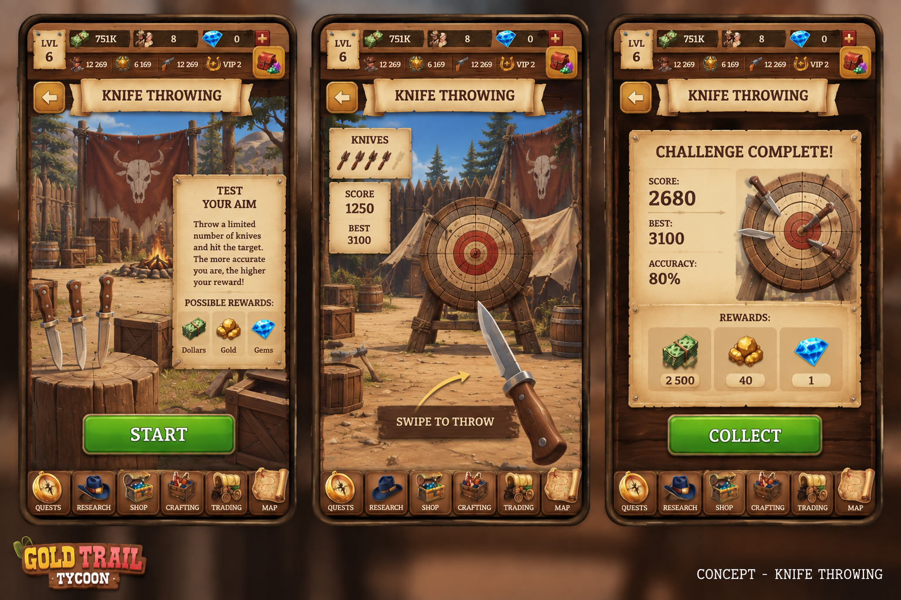

Po porazení tábora banditov:

**Bandit Camp → Defeat banditi → Vyčistený tábor banditov**

Vzniká princíp:

**Objaviť → Poraziť → Premeniť → Znovu použiť**

### Knife Throwing Challenge

**Kde:** Vyčistený tábor banditov

**Kedy:** Po porazení a vyčistení tábora banditov.

Hráč má obmedzený počet nožov a hádže ich do dreveného terča.

Smer a sila swipe ovplyvnia hod.

### Gameplay

**OBJAVIŤ TÁBOR BANDITOV → PORAZIŤ BANDITOV → VYČISTIŤ TÁBOR → SPUSTIŤ NOŽOVÚ VÝZVU → MIERIŤ / SWIPE → HODIŤ → ZÁSAH → SKÓRE → ODMENA**

### Prečo dáva zmysel

Knife Throwing tematicky patrí k tábora banditov a dáva už porazeným táborom ďalšie využitie.

---

## 3.2 Safe Cracking

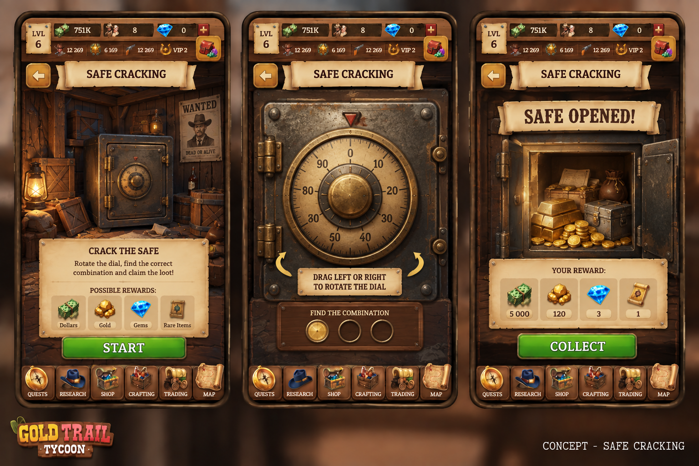

### Kde

Primárne:

**Tábor banditov / lúpežné stretnutia**

Trezor sa môže objaviť po porazení tábora banditov, v banditskom úkryte, počas lúpežného stretnutia alebo ako špeciálny prieskum objekt.

### Ako funguje

Hráč otáča dialom:

**ŤAHAŤ DOĽAVA / DOPRAVA → OTÁČAŤ ČÍSELNÍKOM**

Pri približovaní sa k správnej pozícii dostáva:

**ZVUK + VIBRÁCIE + JEMNÁ VIZUÁLNA SPÄTNÁ VÄZBA**

Kombinácia môže vyžadovať viac krokov a zmenu smeru otáčania.

### Gameplay

**NÁJSŤ TREZOR → SPUSTIŤ PÁČENIE → OTÁČAŤ → VNÍMAŤ / POČÚVAŤ → NÁJSŤ KOMBINÁCIU → ODOMKNÚŤ → OTVORIŤ → ZOBRAŤ KORISŤ**

Ťažšie trezory môžu mať slabší feedback, menšie správne okno, viac krokov alebo časový limit.

### Odmena

Safe Cracking nie je primárne výzva na skóre.

Motivácia je:

**ČO SA SKRÝVA V TREZORE?**

Obsah môže zahŕňať Dollary, zlato, drahokamy alebo vzácne predmety.

### Prečo dáva zmysel

Ide o opakovane použiteľná **Hádanka / Poklad** mechaniku:

**PRESKÚMAŤ → NÁJSŤ STRETNUTIE → NÁJSŤ TREZOR → OTVORIŤ TREZOR → ZÍSKAŤ KORISŤ**

---

## 3.3 Quick Draw Duel

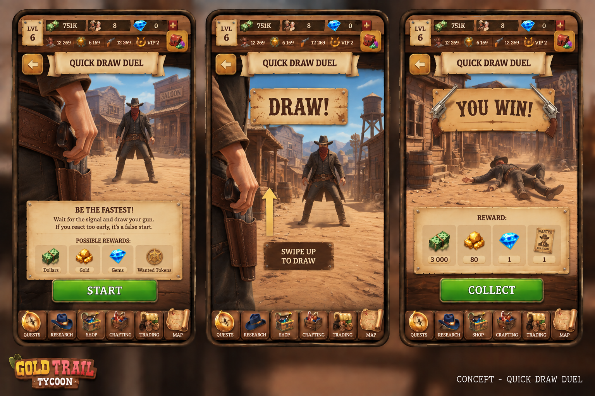

### Kde

**Stretnutie s banditmi / prieskumné stretnutie**

### Ako funguje

Hráč stojí oproti banditovi a musí čakať na:

**TAS!**

Ak reaguje príliš skoro:

**PREDČASNÁ REAKCIA**

Ak reaguje správne, rozhoduje reakčný čas.

### Ovládanie

Preferované:

**ČAKAŤ → TAS! → SWIPE UP → VYSTRELIŤ**

Alternatívne jednoduchý tap.

### Gameplay

**STRETNUTIE S BANDITOM → PRIJAŤ DUEL → ČAKAŤ → TAS! → QUICK DRAW → VÝHRA / PREHRA → ODMENA**

### Prečo dáva zmysel

**Revolver Shooting = mierenie + presnosť + rozpoznanie cieľa**

**Quick Draw Duel = očakávanie + reakčný čas**

Quick Draw funguje ako veľmi krátky westernový stretnutie počas prieskumu.

---

# 4. Aktivity Sheriffa

## Základný koncept

Sheriff poskytuje aktívne westernové challenges a obsah s odmenami za dolapenie.

Dve hlavné definované aktivity sú:

**Revolver Shooting Challenge**

a

**Plagát hľadaného Hunt**

---

## 4.1 Revolver Shooting Challenge

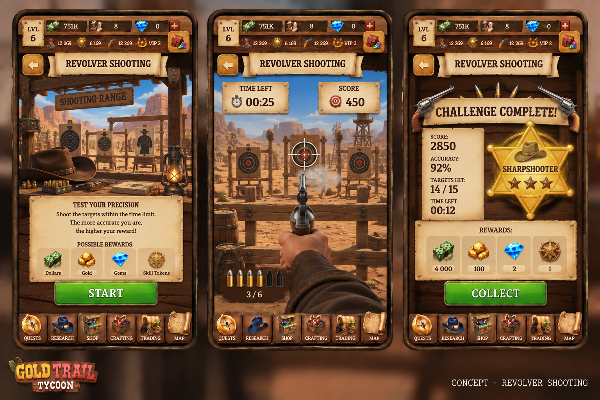

### Kde

**Sheriff → Strelnica → Revolver Shooting Challenge**

### Kedy

Po odomknutí a postavení Sheriffa.

### Ako funguje

Hráč má revolver so **6 nábojmi**.

Objavujú sa:

**banditi**

**Targets**

**Bottles**

**Civilians**

Rozhodovanie:

**Bandit → VYSTRELIŤ**

**Bottle / Target → VYSTRELIŤ**

**Civilian → DON'T VYSTRELIŤ**

### Ovládanie

Preferované:

**MOVE PHONE → GYRO MIERIŤ → TAP → VYSTRELIŤ**

Po šiestich výstreloch môže nasledovať jednoduchý swipe reload.

Alternatíva:

**Mierenie dotykom**

### Gameplay

**VSTÚPIŤ K SHERIFFOVI → SPUSTIŤ STREĽBU → OBJAVÍ SA CIEĽ → MIERIŤ → STRELIŤ / NESTRELIŤ → ZÁSAH / MINUTIE → ĎALŠÍ CIEĽ → NABIŤ → SKÓRE → ODMENA**

### Budúce rozšírenia

Neskôr možno pridať:

**Headshots**

**Combos**

**Moving Targets**

**Smaller Targets**

**Rýchlejšie zmeny cieľov**

**Bonus Objects**

---

## 4.2 Plagát hľadaného Hunt

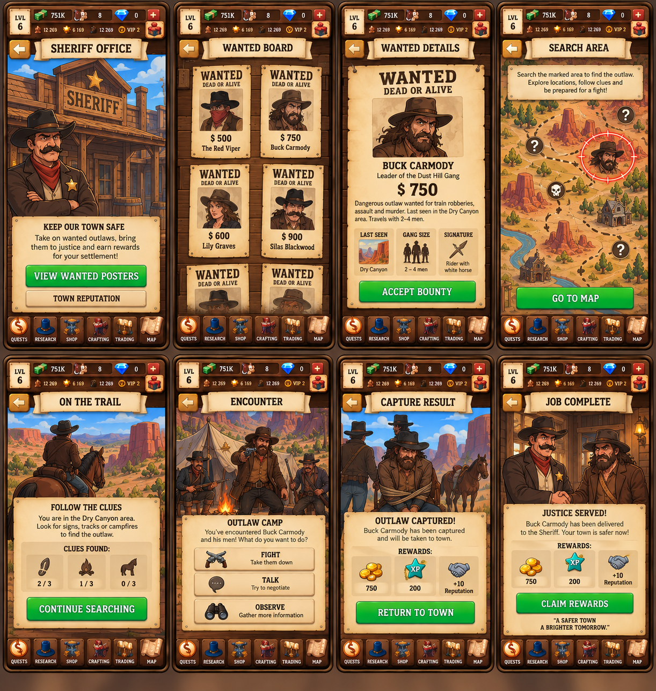

### Základný koncept

Plagát hľadaného Hunt je:

**Aktivita Sheriffa + Systém odmien za dolapenie + Prieskumné stretnutie**

### Kde

Začína pri **Sheriffovi**.

Samotný Hľadaný cieľ sa nachádza niekde na mape.

### Kedy

Po odomknutí Sheriffa.

Sheriff môže pravidelne ponúkať nový **Plagát hľadaného**.

### Plagát hľadaného

Poster môže obsahovať:

**Portrét**

**Name**

**Odmena za dolapenie**

**Posledná známa lokácia**

**Vizuálne stopy**

**Gang Information**

### Gameplay

**SHERIFF → TABUĽA HĽADANÝCH → VYBRAŤ PLAGÁT → PRIJAŤ ODMENU → HĽADAŤ NA MAPE → SLEDOVAŤ STOPY → NÁJSŤ PODOZRIVÉHO → IDENTIFIKOVAŤ / BOJOVAŤ / ZAJAT → VRÁTIŤ SA → ODMENA**

### Hľadať

Hráč nemusí dostať presnú pozíciu banditu.

Môže dostať približnú oblasť a jednoduché clues.

Cieľom však nie je vytvoriť komplexnú detektívnej hry.

Plagát hľadaného Hunt má predovšetkým motivovať hráča k prieskum.

### Stretnutie

Po nájdení banditu môže nasledovať:

**Quick Draw**

alebo:

**Combat**

podľa typu bounty.

### Prečo dáva zmysel

**SHERIFF → QUEST → PRIESKUM → STRETNUTIE NA MAPE → BANDIT → ODMENA**

---

# 5. Gold Panning

## 5.1 Gold Panning Challenge

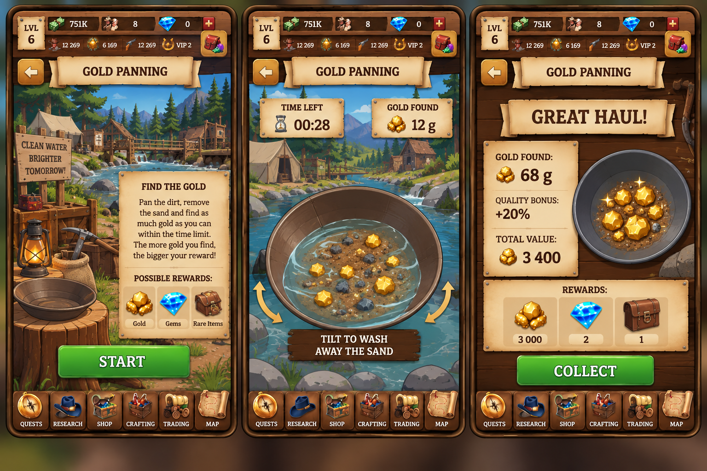

### Kde

Vybrané miesta na riekach:

**Miesto na ryžovanie zlata**

Nie každý riečne políčko musí obsahovať túto aktivitu.

### Kedy

Po objavení vhodného miesta na ryžovanie zlata.

Prípadný úroveň hráča alebo odomknutie cez Výskum sa vyrieši neskôr.

### Ako funguje

Panvica obsahuje:

**Water**

**Sand**

**Stones**

**Potenciálne zlato**

Hráč sa snaží odstrániť nepotrebný materiál a zároveň nestratiť zlato.

Základný konflikt:

**SPEED vs. PRECISION**

**RISK vs. ODMENA**

### Ovládanie

**NAKLONIŤ TELEFÓN → NAKLONIŤ PANVICU**

**SWIPE / CIRCLE → UMÝVAŤ MATERIÁL**

Alternatíva:

**Ovládanie iba dotykom**

### Gameplay

**OBJAVIŤ MIESTO NA RYŽOVANIE ZLATA → SPUSTIŤ RYŽOVANIE → NAKLONIŤ PANVICU → ODPLAVIŤ PIESOK → ODHALIŤ ZLATO → ZOBRAŤ → ODMENA**

### Odmena

Odmena predstavuje to, čo hráč reálne nájde v panvici.

Napríklad:

**Malý zlatý nuget**

**Veľký zlatý nuget**

**Rare Gem**

**Rare Item**

Presný tabuľka koristi sa vyrieši neskôr.

### Prečo dáva zmysel

**PRIESKUM → RIEKY → OBJAVENIE ZLATA → AKTÍVNY GAMEPLAY → ODMENA V ZDROJOCH → EKONOMIKA**

---

## 5.2 Fishing / Rybolov

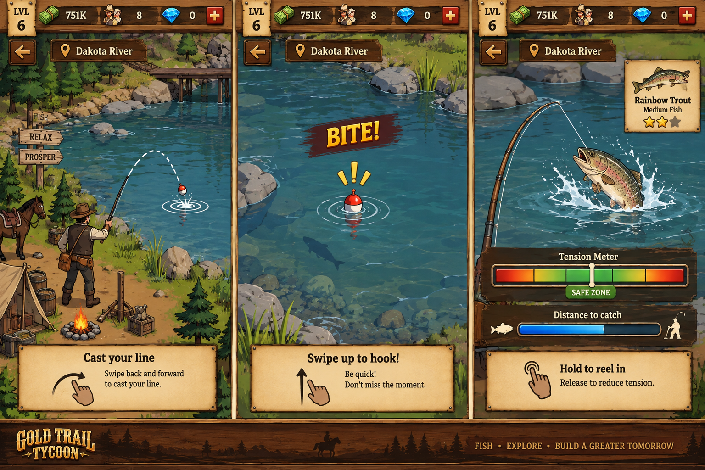

### Koncept

Fishing je krátka skill-based minihra spojená s vodnými plochami v Gold Trail Tycoon. Hráč môže rybárčiť pri riekach, jazerách, pobreží, na Fishing Spots alebo z Fishing Boat. Jeden pokus trvá približne 15–30 sekúnd.

### Kde

**River / Lake / Coastal Waters / Fishing Spot / Fishing Boat**

Nie každé vodné políčko musí umožňovať aktívne rybárčenie. Konkrétne Fishing Spots môže hráč objaviť počas explorácie.

### Prepojenie s existujúcim systémom

Fishing dopĺňa existujúcu pasívnu produkciu cez **Fishing Net** a **Fishing Boat**. Využíva kategórie rýb **Small Fish**, **Medium Fish** a **Big Fish** a pridáva aktívny spôsob získavania rýb a bonusových odmien.

### Kedy

Po objavení vhodného vodného miesta alebo Fishing Spotu počas explorácie.

### Ako funguje

Hráč najprv nahodí udicu gestom **SWIPE BACK → SWIPE FORWARD**. Po krátkom čakaní príde signál **BITE!** a plavák sa ponorí. Hráč musí v krátkom časovom okne použiť **SWIPE UP** na zaseknutie ryby.

Po úspešnom zaseknutí začne súboj. **HOLD → REEL IN** priťahuje rybu, ale zvyšuje napätie vlasca. **RELEASE → REDUCE TENSION** zastaví navíjanie a napätie začne klesať. Hráč sleduje **Tension Meter** a **Distance to Catch**. Pri príliš vysokom napätí hrozí **LINE BROKE**, pri príliš neskorej reakcii **FISH ESCAPED**.

### Tension Meter a Distance to Catch

Bezpečná zóna umožňuje rybu priťahovať a znižovať vzdialenosť. Príliš vysoké napätie môže pretrhnúť vlasec, zatiaľ čo príliš dlhé uvoľnenie umožní rybe získať vzdialenosť. Keď Distance to Catch dosiahne nulu, zobrazí sa **CATCH!** a reward screen, napríklad **Rainbow Trout · Medium Fish · Rating 2/3**.

### Typy rýb

**Small Fish** – krátky fight, pomalé zmeny napätia, široká Safe Zone a menšia odmena.

**Medium Fish** – dlhší fight, výraznejšie výpady, častejšie zmeny napätia a vyššia odmena.

**Big Fish** – silné výpady, rýchly rast napätia a hodnotnejšia odmena.

### Návnada

**Worm**, **Insect** a **Lure** sú budúce možnosti. Môžu ovplyvňovať pravdepodobnosť záberu, typ ryby, šancu na väčšiu rybu alebo kvalitu odmeny.

### Ovládanie

**CAST:** Swipe back + forward

**HOOK:** Swipe up

**REEL:** Hold

**REDUCE TENSION:** Release

Celá minihra je navrhnutá pre pohodlné ovládanie jedným prstom.

### Gameplay

**CHOOSE FISHING SPOT → CAST → WAIT → BITE! → SWIPE UP TO HOOK → REEL / RELEASE → MANAGE TENSION → REDUCE DISTANCE → CATCH → REWARD**

### Prečo dáva zmysel

Fishing vytvára aktívny gameplay pre Rivers, Lakes, Coastal Waters, Fishing Spots a Fishing Boats. Od Gold Panning sa odlišuje prácou s napätím, od Archery a Revolver Shooting mierením a od Quick Draw reakciou. Jadro tvorí **REACTION + TIMING + TENSION MANAGEMENT**.

### Budúce rozšírenia

Rôzne a vzácne druhy rýb, nové Fishing Spots, návnady, lepšie fishing equipment, rybárčenie z Fishing Boat, eventové ryby, Legendary Fish a Collections / Fishing Book zostávajú budúcimi možnosťami, nie požiadavkami pre MVP.

---

# 6. Aktivity v bani

## 6.1 Dynamite Mining

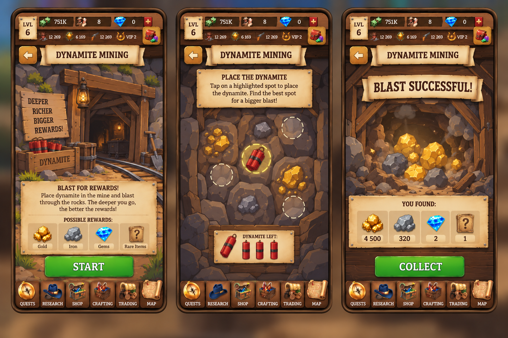

### Kde

Primárne:

**Baňa → Dynamite Mining**

Nie ako bežný samostatný bod záujmu na mape.

### Kedy

Po odomknutí Baňa a prístupe k **Dynamite**.

Presná úroveň hráča, úroveň bane alebo požiadavka Výskum sa vyrieši neskôr.

### Ako funguje

Hráč vidí skalnú stenu s vizuálnymi indíciami:

**Cracks**

**Ore Fragments**

**Rock Structure**

**Rock Color**

Hráč musí rozhodnúť, kam umiestni dynamit.

### Gameplay

**VSTÚPIŤ DO BANE → PRESKÚMAŤ HORNINU → VYBRAŤ MIESTO VÝBUCHU → UMIESTNIŤ DYNAMIT → ODPÁLIŤ → ROZBIŤ SKALU → ODHALIŤ KORISŤ → ZOBRAŤ**

### Loot podľa bane

Rovnaká mechanika môže fungovať naprieč viacerými typmi baní:

**Uhoľná baňa → Coal**

**Železná baňa → Iron**

**Zlatá baňa → Zlato**

### Dynamite

Dynamite je reálny spotrebný zdroj.

Ekonomický loop:

**ZÍSKAŤ / VYROBIŤ DYNAMIT → POUŽIŤ V BANI → VYBRAŤ MIESTO VÝBUCHU → ZÍSKAŤ ĎALŠIE ZDROJE**

Spôsob získavania Dynamite sa vyrieši neskôr.

### Prečo dáva zmysel

Baňa tak nebude iba pasívna výrobná budova.

Vzniká:

**POSTAVIŤ BAŇU → PASÍVNE VYRÁBAŤ → VSTÚPIŤ DO BANE → AKTÍVNE ŤAŽIŤ → ĎALŠIE ZDROJE**

---

# 7. Aktivity na Ranchi

## Základný koncept

Ranch môže poskytovať niekoľko tematických westernových aktivít:

**Horseshoe Challenge**

**Lasso Challenge**

**Horse Riding Challenge**

---

## 7.1 Horseshoe Challenge

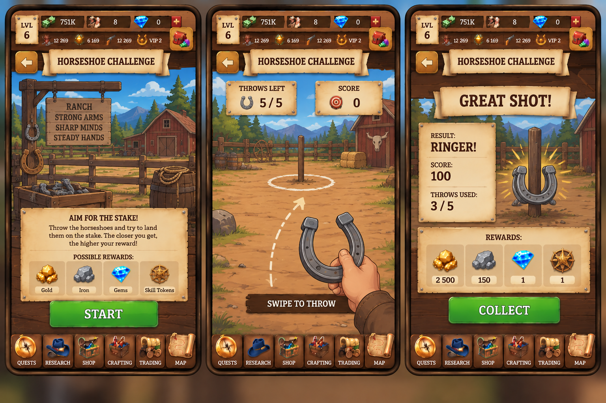

### Kde

**Ranch → Horseshoe Challenge**

### Kedy

Po odomknutí a postavení Ranchu.

### Ako funguje

Hráč hádže niekoľko podkov ku kolíku.

Výsledok môže byť:

**MISS**

**CLOSE**

**LEANER**

**RINGER**

### Ovládanie

**MIERIŤ → SWIPE → UVOLNIŤ → HODIŤ → LAND → SKÓRE**

Smer a sila swipe ovplyvňujú trajektóriu.

### Gameplay

**VSTÚPIŤ NA RANCH → SPUSTIŤ PODKOVOVÚ VÝZVU → MIERIŤ → HODIŤ → DOPAD → SKÓRE → ĎALŠÍ HOD → KONEČNÉ SKÓRE → ODMENA**

### Prečo dáva zmysel

Ide o jednoduchú westernovú aktivitu tematicky priamo spojenú s Ranchom.

Zároveň sa gameplayovo odlišuje od Knife Throwing.

**Nôž = Presnosť zásahu**

**Horseshoe = Trajectory + Power + Distance**

---

## 7.2 Lasso Challenge

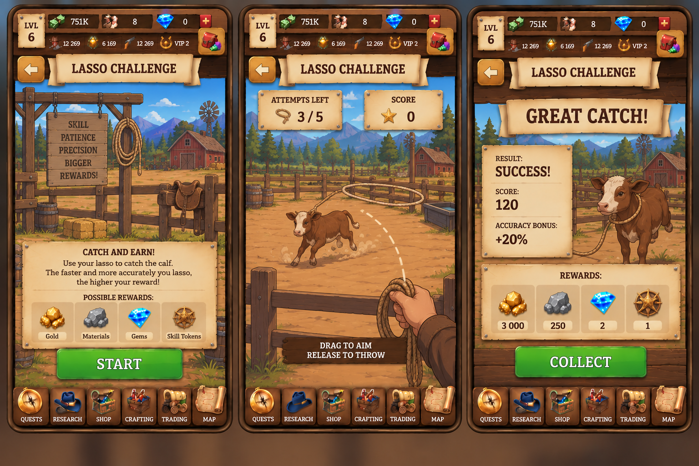

### Kde

**Ranch → Aktivity na Ranchi → Lasso Challenge**

### Ako funguje

Pred hráčom sa pohybuje zviera.

Napríklad:

**Calf**

**Cow**

**Horse**

**Wild Horse**

Hráč sleduje pohyb zvieraťa a predvída jeho budúcu pozíciu.

Základ:

**MIERIŤ + NAČASOVANIE + PREDVÍDANIE**

### Ovládanie

**DOTYK → CIRCLE / TOČIŤ LASOM → MIERIŤ → SWIPE / UVOLNIŤ → HODIŤ**

Kruhové gesto je dôležitou identitou tejto minihry.

### Gameplay

**VSTÚPIŤ NA RANCH → SPUSTIŤ LASO VÝZVU → OBJAVÍ SA ZVIERA → SLEDOVAŤ POHYB → TOČIŤ LASOM → MIERIŤ → HODIŤ → CHYTIŤ / MINÚŤ → ĎALŠÍ POKUS → KONEČNÉ SKÓRE → ODMENA**

### Difficulty

Ťažšie zvieratá môžu:

**Move Faster**

**Change Direction**

**Stay Further Away**

**Present Smaller Catch Windows**

### Budúcnosť

Mechaniku možno neskôr použiť aj mimo Ranchu:

**OBJAVIŤ DIVÉ ZVIERA → SPUSTIŤ LASO STRETNUTIE → CHYTIŤ**

Potenciálne:

**DIVOKÝ KÔŇ → LASO → ZACHYTIŤ KOŇA**

To však nie je nutné pre základnú verziu.

### Laso z koňa

Pokročilejšia verzia môže kombinovať:

**JAZDA NA KONI + LASO**

---

## 7.3 Horse Riding Challenge

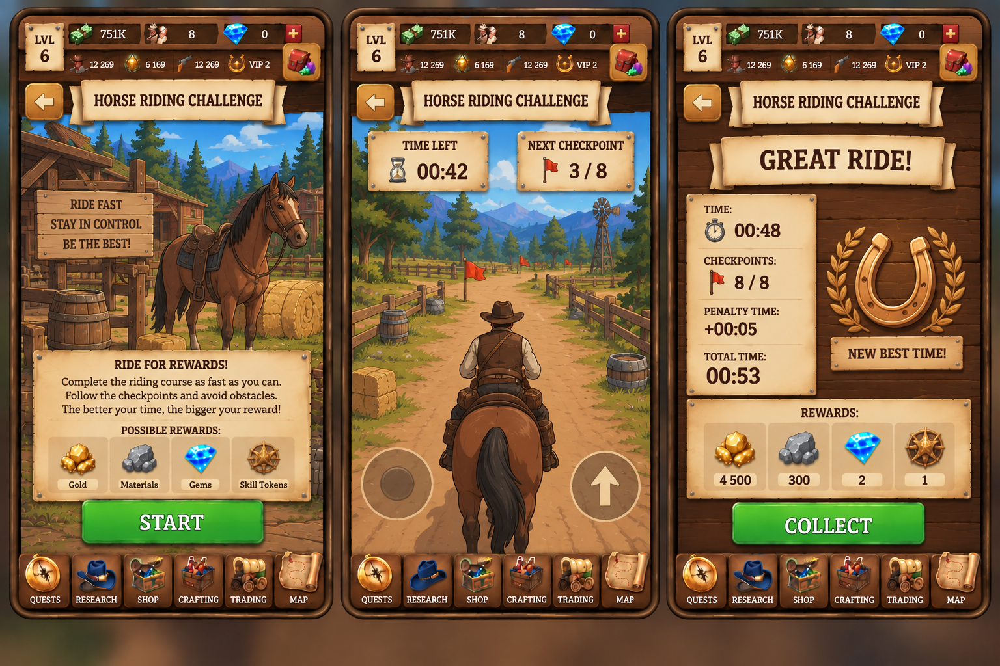

### Kde

**Ranch → Aktivity na Ranchi → Horse Riding Challenge**

### Kedy

Po odomknutí Ranchu, pravdepodobne neskôr než Horseshoe.

### Ako funguje

Ide o krátku westernovú jazdu.

Kôň automaticky beží dopredu.

Hráč rieši:

**Direction**

**Dodging**

**Jumping**

Na trase sa nachádzajú napríklad:

**Rocks**

**Fallen Trees**

**Fences**

**Narrow Passages**

**Prírodné prekážky**

Nejde o endless runner.

Cieľom je dostať sa z bodu A do bodu B.

### Ovládanie

**KÔŇ BEŽÍ AUTOMATICKY → DOĽAVA / DOPRAVA → SKOK**

Swipe left/right môže ovládať smer.

Swipe up môže ovládať jump.

### Gameplay

**VSTÚPIŤ NA RANCH → SPUSTIŤ TRAŤ → JAZDIŤ → VYHNÚŤ SA → SKOK → DOSIAHNUŤ CIEĽ → ČAS / SKÓRE → ODMENA**

Kolízia nemusí znamenať okamžitý fail.

Môže napríklad spomaliť koňa alebo pridať penalty time.

### Reusable Horse Riding

Rovnaký systém možno neskôr použiť ako:

**Preteky**

**Naháňačka banditov**

**Útek**

**Doručenie**

**Laso z koňa**

### Horses

Pre prvú verziu nie je potrebný systém zbierania koní.

Základ:

**RANCH → SPUSTIŤ VÝZVU → VÝCHODISKOVÝ KÔŇ → JAZDIŤ**

vlastníctvo koní, rarity, breeding a komplexné horse stats sú potenciálne budúce systémy.

### Prečo dáva zmysel

Horse Riding pridáva aktívnu westernovú jazdu bez potreby vytvárať samostatný komplexný horse-management systém.

---

# 8. Aktivity železničnej stanice

## 8.1 Train Loading

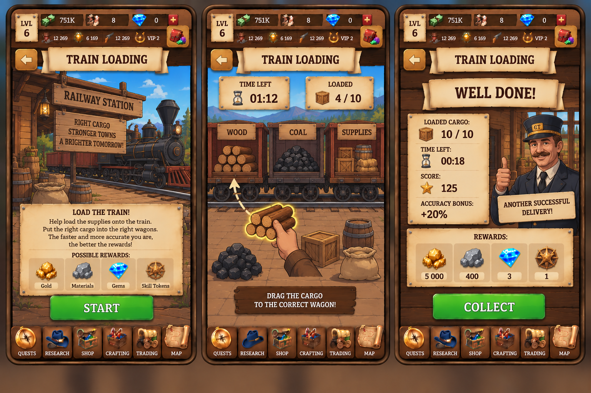

### Kde

**Železničná stanica → Train Loading**

### Kedy

Po odomknutí a postavení Železničná stanica.

### Ako funguje

Na stanicu príde vlak.

Hráč má obmedzený čas a musí presúvať cargo do správnych vagónov.

Napríklad:

**DREVO → DREVENÝ VAGÓN**

**COAL → COAL WAGON**

**SUPPLIES → SUPPLY WAGON**

### Ovládanie

**PRETIAHNUŤ NÁKLAD → SPRÁVNY VAGÓN → PUSTIŤ**

### Gameplay

**VLAK PRÍDE → OBJAVÍ SA NÁKLAD → ROZPOZNAŤ NÁKLAD → PRETIAHNUŤ DO SPRÁVNEHO VAGÓNA → NALOŽIŤ → ĎALŠÍ NÁKLAD → VLAK ODÍDE → SKÓRE / ODMENA**

Základ:

**RÝCHLOSŤ + ROZPOZNANIE + SPRÁVNE TRIEDENIE**

### Mistakes

Nesprávne cargo môže:

**Lose Time**

**Znížiť skóre**

alebo sa musí presunúť späť.

Presný systém sa vyrieši neskôr.

### Budúcnosť

Neskôr možno pridať obmedzenú kapacitu vlaku.

Potom vzniká:

**TRIEDENIE → KAPACITA → PRIORITIZÁCIA**

Hráč nebude schopný naložiť všetko a musí rozhodnúť, ktorý cargo má vyššiu hodnotu alebo prioritu.

### Prečo dáva zmysel

**PRODUKCIA → ZDROJE → LOGISTIKA → ŽELEZNICA**

Železničná stanica tak získava vlastnú aktívnu gameplay funkciu naviazanú na ekonomiku hry.

---

# 9. Expedície

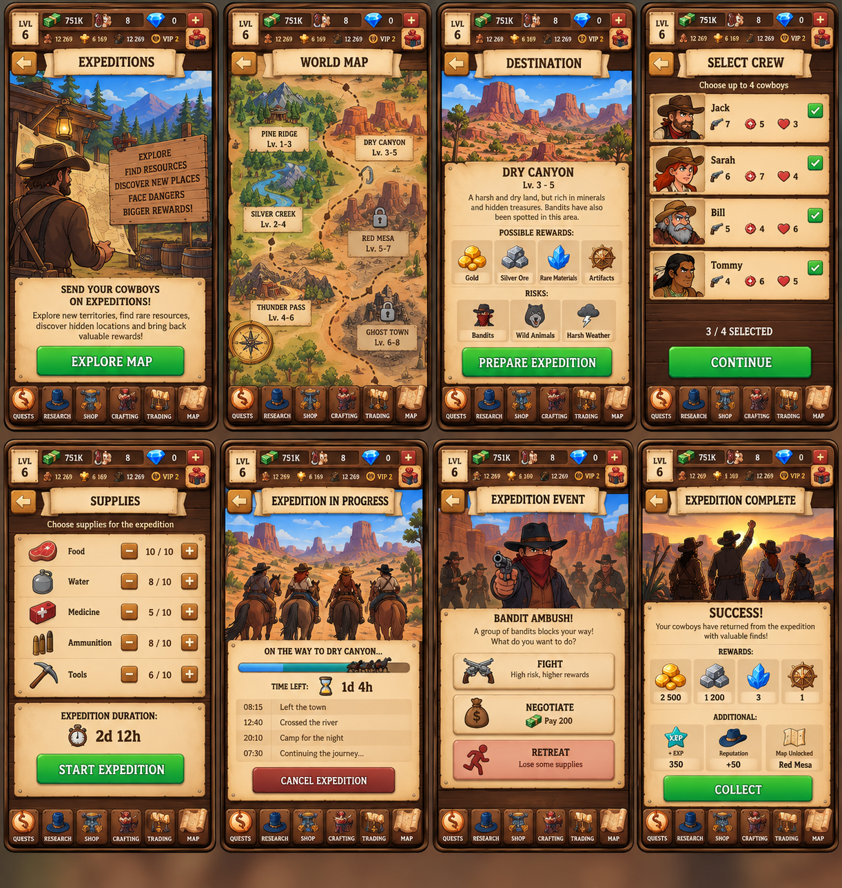

## Základný koncept

Expedície sú väčší gameplay systém, nie samostatná krátka minihra.

Umožňujú hráčovi organizovať výpravy do vzdialenejších oblastí sveta za konkrétnym cieľom.

Základné rozdelenie:

**Prieskum = postupné odhaľovanie okolitej mapy**

**Expedition = organizovaná výprava za vzdialeným cieľom**

Expedície zároveň vytvárajú rámec, ktorý môže prepájať veľkú časť existujúcich minihier a stretnutia.

---

## 9.1 Kde

Expedície budú naviazané na:

**Map / Hlavná osada**

Hráč si na mape vyberie vzdialenejšiu destináciu a pripraví expedíciu.

Pre základnú verziu nie je nutné vytvárať samostatnú budovu Expedície.

---

## 9.2 Kedy

Expedície dávajú väčší zmysel až v strednej fáze hry.

Hráč by už mal:

**Poznať prieskum**

**Mať kovboji**

**Produkovať viac zdroje**

**Poznať základné Encounters**

Presný unlock úroveň sa vyrieši neskôr.

---

## 9.3 Destinácia

Hráč otvorí mapu Expedície a vyberie destináciu.

Jednotlivé lokality môžu mať:

**Recommended Level**

**Possible Rewards**

**Possible Risks**

**Dĺžka expedície**

Napríklad:

**Silver Creek**

**Dry Canyon**

**Thunder Pass**

**Red Mesa**

**Ghost Town**

Presné názvy sú zatiaľ pracovné.

---

## 9.4 Príprava expedície

Pred cestou hráč rieši tri základné otázky:

**KAM IDEM?**

**KOHO POSIELAM?**

**AKÉ ZÁSOBY BERIEM?**

Základ:

**VYBRAŤ DESTINÁCIU → VYBRAŤ KOVBOJOV → PRIPRAVIŤ ZÁSOBY → SPUSTIŤ EXPEDÍCIU**

Pre prvú verziu nie je potrebný komplikovaný party-management systém.

---

## 9.5 kovboji

Hráč vyberie malú skupinu kovboji.

kovboji budú zároveň využití v Combat systéme.

Presný počet členov expedície a význam jednotlivých stats sa vyrieši neskôr.

---

## 9.6 zásoby

Expedition môže vyžadovať supplies.

Potenciálne:

**Food**

**Water**

**Medicine**

**Ammunition**

**Tools**

Nemusia byť všetky potrebné v prvej verzii.

zásoby vytvárajú prepojenie:

**OSADA → PRODUKCIA → PRÍPRAVA EXPEDÍCIE**

---

## 9.7 Cesta

Po odštartovaní expedícia cestuje smerom k destinácii.

Počas cesty môžu nastať rôzne **Encounters**.

### Stretnutie s banditmi

**BANDITI → QUICK DRAW / COMBAT**

### Abandoned Camp / Hideout

**OBJAVIŤ TREZOR → SAFE CRACKING → KORISŤ**

### Rieka

**OBJAVIŤ ZLATO → GOLD PANNING**

### Wild Animal

**DIVOKÝ KÔŇ / ZVIERA → LASO**

### Zablokovaná cesta

**PREKÁŽKA → DYNAMIT → UVOLNIŤ CESTU**

Nemusí sa pri každej expedícii objaviť každý stretnutie.

Kombinácia udalostí vytvára variabilitu jednotlivých výprav.

---

## 9.8 Ciele expedície

Každá expedícia by mala mať konkrétny dôvod.

Potenciálne ciele:

**Nájsť ložisko zlata**

**Prehľadať opustenú baňu**

**Find Lost Caravan**

**Hunt banditi**

**Objaviť nové územie**

**Získať poklad**

Cieľ určuje, prečo hráč expedíciu podniká a aký typ hlavnej odmeny môže očakávať.

---

## 9.9 Gameplay Loop

**VYBRAŤ DESTINÁCIU → PRIPRAVIŤ EXPEDÍCIU → VYSLAŤ KOVBOJOV → CESTOVAŤ → STRETNUTIA → DORAZIŤ DO DESTINÁCIE → SPLNIŤ CIEĽ → ZÍSKAŤ ODMENU → VRÁTIŤ SA DOMOV**

Širší ekonomický loop:

**TYCOON → VYRÁBAŤ ZDROJE → PRIPRAVIŤ EXPEDÍCIU → PRESKÚMAŤ ZÁPAD → HRAŤ STRETNUTIA → NÁJSŤ CENNOSTI → PRINIESŤ ODMENY DOMOV**

---

## 9.10 Prepojenie s minihry

Expedície môžu prirodzene znovu používať už vytvorené mechaniky.

**Quick Draw → Stretnutie s banditmi**

**Combat → Stretnutie so skupinou banditov**

**Safe Cracking → Opustený úkryt**

**Gold Panning → Riečne stretnutie**

**Lasso → Stretnutie s divým zvieraťom**

**Dynamite → Zablokovaná cesta / banské stretnutie**

---

## 9.11 Prečo dáva zmysel

Expedície prepájajú tycoon časť hry s aktívnym westernovým dobrodružstvom.

**POSTAVIŤ → VYRÁBAŤ → PRIPRAVIŤ → PRESKÚMAŤ → STRETNUTIE → ODMENA → VRÁTIŤ SA → POSTAVIŤ**

---

# 10. Trading Post

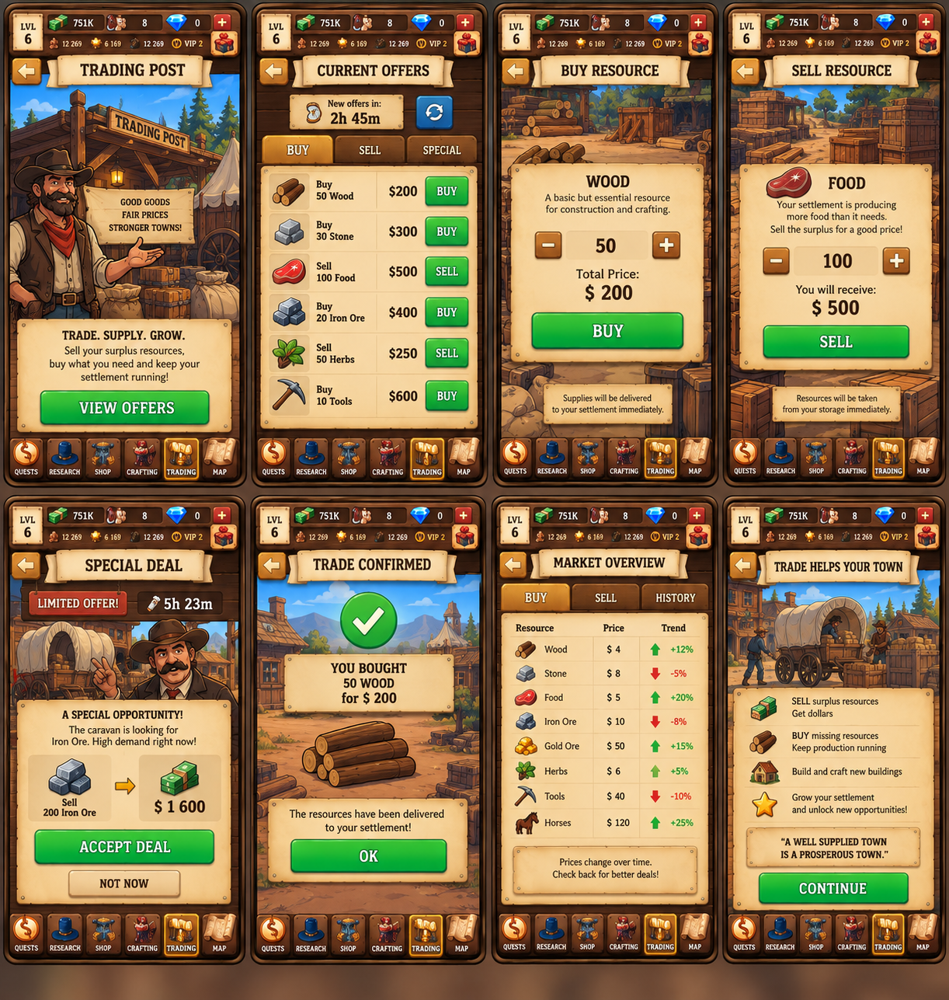

## Základný koncept

Trading Post je ekonomický gameplay systém.

Jeho úlohou nie je poskytovať ďalšiu zručnostnú minihru, ale umožniť hráčovi pracovať s prebytočnými a nedostatkovými zdroje.

Hráč môže:

**PREDAŤ SURPLUS ZDROJE**

a

**NAKÚPIŤ NEEDED ZDROJE**

---

## 10.1 Kde

**Trading Post → Obchodovanie**

Použije sa existujúca budova **Trading Post**.

---

## 10.2 Kedy

Po odomknutí a postavení Trading Postu.

Presná úroveň hráča sa vyrieši neskôr.

---

## 10.3 Aktuálne ponuky

Trading Post ponúka hráčovi aktuálne obchodné ponuky.

Napríklad:

**PREDAŤ 100 WOOD → GET $500**

alebo:

**PAY $800 → GET 50 IRON**

Ponuky sa po určitom čase obmenia.

---

## 10.4 Nákup / Predaj

Hráč môže vstúpiť do detailu ponuky a vybrať množstvo resource.

### Buy

**VYBRAŤ ZDROJ → VYBRAŤ MNOŽSTVO → ZOBRAZIŤ CELKOVÚ CENU → NAKÚPIŤ**

### Sell

**VYBRAŤ ZDROJ → VYBRAŤ MNOŽSTVO → ZOBRAZIŤ PLATBU → PREDAŤ**

---

## 10.5 Gameplay

**ENTER TRADING POST → SKONTROLOVAŤ PONUKY → VYBRAŤ OBCHOD → NAKÚPIŤ / PREDAŤ → ZDROJE / DOLLARY SA ZMENIA → ČAKAŤ NA NOVÉ PONUKY**

Gameplayom je ekonomické rozhodovanie.

---

## 10.6 Špeciálne ponuky

Trading Post môže príležitostne ponúknuť:

**ŠPECIÁLNA PONUKA**

Napríklad obchodná karavána môže hľadať konkrétny resource a ponúknuť lepšiu cenu.

To vytvára krátkodobé ekonomické príležitosti.

---

## 10.7 Prepojenie s produkciou

**VYRÁBAŤ → VYTVORIŤ PREBYTOK → OBCHODOVAŤ → ZÍSKAŤ POTREBNÝ ZDROJ → POSTAVIŤ / CRAFT**

Trading Post tak dáva význam prebytkom zdroje.

---

## 10.8 Železničná stanica

Funkcie zostávajú oddelené:

**Trading Post = Ekonomika / Obchodovanie**

**Železničná stanica = Transport / Logistika**

Neskôr môže Železničná stanica potenciálne rozšíriť Trading Post o:

**Distant Markets**

**Large Shipments**

**Špeciálne obchodné trasy**

---

## 10.9 Prečo dáva zmysel

**PRODUKCIA → SURPLUS → TRADING POST → OBCHODOVAŤ → POTREBNÝ ZDROJ → NAPREDOVANIE**

---

# 11. Combat systém

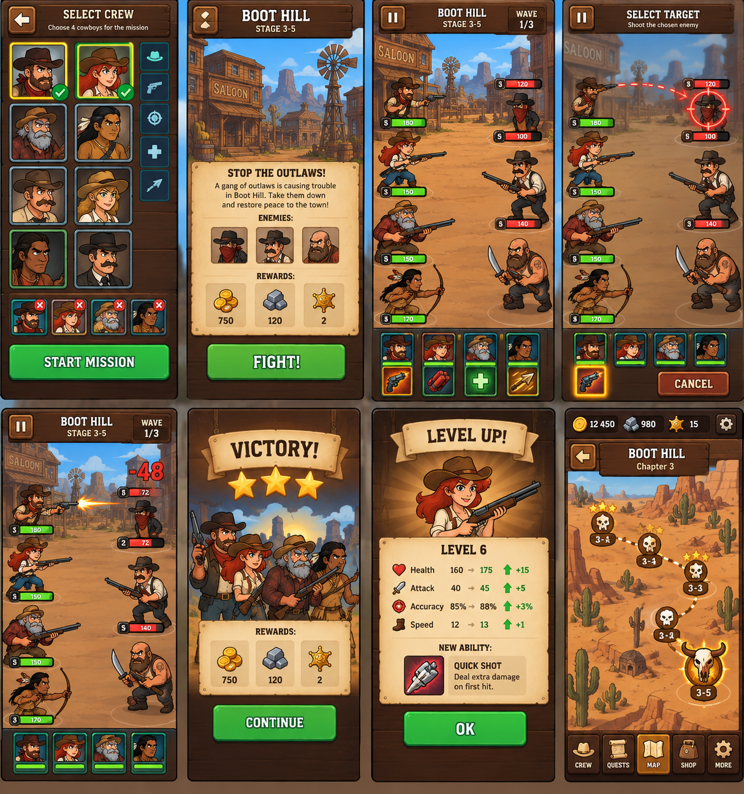

## Základný koncept

Combat bude jednoduchý **semi-automatický RPG súbojový systém**.

Postavy bojujú prevažne automaticky, ale hráč aktívne vstupuje do boja prostredníctvom správne načasovaných vstupov a používania schopností.

Cieľom nie je vytvoriť komplexné ťahové RPG.

Základ:

**AUTOMATICKÝ SÚBOJ + NAČASOVANIE HRÁČA + ŠPECIÁLNE ÚTOKY**

---

## 11.1 Kde

Combat sa môže objavovať predovšetkým pri:

**Bandit Camps**

**Bandit Encounters**

**Plagáty hľadaných**

**Expedície**

a neskôr pri ďalších nepriateľských stretnutia.

---

## 11.2 Zloženie súboja

Combat obrazovka je vo **vertikálnom formáte**.

Kompozícia:

**KOVBOJI HRÁČA → ĽAVÁ STRANA**

**NEPRIATELIA / BANDITI → PRAVÁ STRANA**

Nie pixel-art ani 8-bit.

Vizuálne zostáva v rovnakom maľovanom 2D westernovom štýle ako Gold Trail Tycoon.

---

## 11.3 Výber tímu

Pred vybranými bojmi môže hráč zvoliť kovboji.

Základ:

**VYBRAŤ KOVBOJOV → ZOSTAVIŤ TÍM → SPUSTIŤ SÚBOJ**

Combat tak dáva význam kovboji, ktorých hráč získava a progresuje.

Presný počet členov tímu sa vyrieši neskôr.

Pracovný smer je malá skupina približne do štyroch kovboji.

---

## 11.4 Automatický boj

Po začiatku boja kovboji a nepriatelia útočia prevažne automaticky.

Základ:

**ÚTOK KOVBOJA → ÚTOK BANDITU → ĎALŠÍ ÚTOK → POKRAČOVAŤ V SÚBOJI**

Hráč nemusí manuálne zadávať každý jednotlivý základný útok.

Aktívna časť vzniká počas samotných útokov.

---

## 11.5 Načasovanie kritického útoku

Pri útoku kovboja dostane hráč krátke okno na načasovanie.

**ÚTOK ZAČNE → ČAKAŤ → ŤUKNÚŤ V SPRÁVNOM MOMENTE → KRITICKÝ ZÁSAH**

Ak hráč trafí správne načasovanie:

**KRITICKÝ ÚTOK / BONUSOVÉ POŠKODENIE**

Ak načasovanie netrafí:

**NORMÁLNY ÚTOK**

Hráč tak môže správnym hraním zvýšiť efektivitu svojho tímu.

---

## 11.6 Načasovanie obrany

Podobný princíp funguje pri útoku nepriateľa.

**ENEMY ATTACK → ČAKAŤ → ŤUKNÚŤ V SPRÁVNOM MOMENTE → BLOK / ZNÍŽENÉ POŠKODENIE**

Správne načasovaný vstup môže znížiť prijatý poškodenie.

Neúspešný načasovanie znamená normálny zásah.

---

## 11.7 Špeciálne útoky

kovboji môžu počas boja získavať energiu do:

**METER ŠPECIÁLU**

Po naplnení:

**ŠPECIÁL JE PRIPRAVENÝ**

Hráč rozhodne, kedy schopnosť použije.

**NABIŤ ŠPECIÁL → ŠPECIÁL JE PRIPRAVENÝ → HRÁČ AKTIVUJE → ŠPECIÁLNY ÚTOK / EFEKT**

Špeciálny útok môže závisieť od konkrétneho kovboja.

---

## 11.8 Bojové rozhranie

Na spodnej časti bojovej obrazovky môžu byť portréty členov tímu.

Pri každom kovbojovi môže hráč vidieť:

**Portrét**

**HP**

**Meter špeciálu**

**Špeciálna schopnosť**

Bojové rozhranie musí zostať dostatočne jednoduché pre mobilný obrazovku na výšku.

---

## 11.9 Gameplay Loop

**STRETNUTIE BANDITS → VYBRAŤ KOVBOJOV → SPUSTIŤ SÚBOJ → AUTOMATICKÝ ÚTOK → ŤUKNUTIE V SPRÁVNOM MOMENTE → KRITICKÝ ÚTOK / BLOK → NABIŤ ŠPECIÁL → POUŽIŤ ŠPECIÁL → PORAZIŤ NEPRIATEĽOV → ODMENA**

---

## 11.10 Zručnosť verzus sila kovbojov

Výsledok boja nemá závisieť iba od reflexov hráča.

Dôležitá zostáva sila kovboji.

**COWBOY POWER / STATS = základná bojová sila**

**NAČASOVANIE HRÁČA = zvýšenie efektivity počas boja**

Silnejší tím má výhodu, ale aktívny hráč môže dobrým načasovaním dosiahnuť lepší výsledok.

Combat tým zostáva prepojený s tycoonovým progresom hry.

---

## 11.11 Combat vs. Quick Draw

Tieto systémy majú rozdielny účel.

### Quick Draw

**1v1**

**ČAKAŤ → DRAW → REACT → VYSTRELIŤ**

Trvá iba niekoľko sekúnd.

Hlavný zručnosť:

**REAKČNÝ ČAS**

### Combat

**kovboji vs. banditi**

Dlhší stretnutie.

Hlavný gameplay:

**SILA TÍMU + NAČASOVANIE + POUŽITIE ŠPECIÁLU**

Oba systémy preto môžu existovať vedľa seba bez toho, aby plnili rovnakú funkciu.

---

## 11.12 Prepojenie s Expedície

Combat môže byť jedným z hlavných stretnutia počas expedície.

Napríklad:

**CESTOVAŤ → PREPADNUTIE BANDITMI → COMBAT → VYHRAŤ → POKRAČOVAŤ V EXPEDÍCII**

alebo:

**REACH BANDIT HIDEOUT → COMBAT → PORAZIŤ BANDITOV → SAFE CRACKING → KORISŤ**

Takto sa môžu jednotlivé systémy skladať do dlhších gameplay sekvencií.

---

## 11.13 Prečo dáva zmysel

Combat vytvára priame využitie kovboji mimo samotnej ekonomiky.

Vzniká:

**SALOON → ZÍSKAŤ KOVBOJOV → ZLEPŠOVAŤ KOVBOJOV → PRESKÚMAŤ / EXPEDÍCIA → COMBAT → ODMENA**

Zároveň hráč počas boja nie je iba pasívny divák.

Systém načasovania umožňuje aktívne ovplyvniť výsledok bez potreby komplexného RPG combat systému.

---

# 12. Dizajn ovládania

Jednotlivé minihry by mali mať odlišnú fyzickú identitu.

| Aktivita          | Hlavné ovládanie                     |
| ----------------- | ------------------------------------ |
| Archery           | Dotyk → Mierenie / napnutie → Uvoľnenie         |
| Knife Throwing    | Swipe → Direction + Power            |
| Revolver Shooting | Gyroskop → Mierenie → Ťuknutie                |
| Quick Draw        | Wait → DRAW → Swipe Up / Tap         |
| Safe Cracking     | Ťahať doľava / doprava → Otáčať číselníkom      |
| Gold Panning      | Gyroskop + dotyk / kruhové gesto |
| Dynamite Mining   | Preskúmať → Vybrať → Umiestniť → Odpáliť  |
| Horseshoe         | Mieriť → Swipe → Smer + sila      |
| Lasso             | Kruhové gesto → Mieriť → Uvoľniť     |
| Horse Riding      | Automatický beh → Smer → Vyhnutie → Skok  |
| Train Loading     | Drag Cargo → Correct Wagon → Drop    |
| Western Dice      | Vybrať stávku → Hodiť                    |
| Combat            | Automatický útok → Ťuknutie v správnom momente → Special   |

Cieľom je, aby minihry neboli iba vizuálne odlišné, ale aby sa aj **fyzicky hrali inak**.

---

# 13. Typy minihier a aktivít

## Zručnosť / Presnosť

**Archery**

**Knife Throwing**

**Revolver Shooting**

**Horseshoe**

**Lasso**

## Reakcia / Načasovanie

**Revolver Shooting**

**Quick Draw**

**Combat**

## Jazda

**Horse Riding**

## Získavanie zdrojov

**Gold Panning**

**Dynamite Mining**

## Logistika

**Train Loading**

## Hádanka / Poklad

**Safe Cracking**

## Stávky / Riziko a odmena

**Western Dice**

Neskôr:

**Farkle**

**Faro**

**Blackjack**

**Poker**

## Combat

**kovboji vs. banditi**

**Bandit Camps**

**Bojové stretnutia počas expedície**

## Ekonomika / Stratégia

**Trading Post**

## Prieskum / Dobrodružstvo

**Native Camp**

**Bandit Encounters**

**Vyčistený tábor banditovs**

**Plagát hľadaného Hunt**

**miesta na ryžovanie zlata**

**Stretnutia s trezormi**

**Expedície**

Potenciálne:

**Stretnutia s divými zvieratami**

---

# 14. Hlavný smer aktívneho gameplayu

Minihry by nemali existovať iba ako oddelené arcade obrazovky.

Pokiaľ je to možné:

**PRESKÚMAŤ → OBJAVIŤ → INTERAGOVAŤ → HRAŤ → ODMENA**

alebo:

**POSTAVIŤ / ODOMKNÚŤ BUDOVU → SPRÍSTUPNIŤ AKTIVITU → HRAŤ → ODMENA**

Expedície pridávajú:

**PRIPRAVIŤ → CESTOVAŤ → STRETNUTIE → CIEĽ → VRÁTIŤ SA**

Ekonomické systémy:

**VYRÁBAŤ → SPRAVOVAŤ → OBCHODOVAŤ → NAPREDOVAŤ**

Combat:

**ZOSTAVIŤ TÍM → STRETNUTIE S NEPRIATEĽMI → BOJOVAŤ → VYHRAŤ → ODMENA**

Vznikajú tak hlavné zdroje gameplayu:

**BUDOVY → AKTIVITY**

**MAPA / BOD ZÁUJMU → STRETNUTIA**

**PRIESKUM → OBJAVY**

**EXPEDÍCIE → DOBRODRUŽNÉ REŤAZCE**

**EKONOMIKA → OBCHODOVANIE**

**KOVBOJI → SÚBOJ**

---

# 15. Opakovane použiteľné gameplay systémy

Dôležitý princíp je nevytvárať každú aktivitu ako úplne izolovaný systém.

Existujúce mechaniky sa môžu používať na viacerých miestach.

## Horse Riding

**Preteky**

**Naháňačka banditov**

**Útek**

**Doručenie**

**Laso z koňa**

## Lasso

**Výzva na Ranchi**

**Stretnutie s divým zvieraťom**

**Stretnutie s divokým koňom**

**Laso z koňa**

## Safe Cracking

**Bandit Camp**

**Lúpežné stretnutie**

**Stretnutie s pokladom**

**Expedition Hideout**

## Combat

**Bandit Camp**

**Prepadnutie banditmi**

**Plagát hľadaného**

**Expedition**

## Quick Draw

**Náhodné stretnutie s banditmi**

**Hľadaný cieľ**

**Stretnutie počas expedície**

## Gold Panning

**Riečne miesto**

**Riečne stretnutie počas expedície**

## Dynamite

**Baňa**

**Zablokovaná cesta expedície**

**Špeciálne prieskumné stretnutie**

Tým sa znižuje počet úplne samostatných systémov, ktoré treba vytvárať, a zároveň svet pôsobí konzistentnejšie.

---

# 16. Identita hlavných budov a systémov

**Saloon → kovboji + Hazardné hry**

**Sheriff → Streľba + odmeny za dolapenie**

**Ranch → Westernové zručnostné aktivity**

**Baňa → Pasívna výroba + aktívna ťažba**

**Železničná stanica → Logistika**

**Trading Post → Ekonomika zdrojov**

**Sklad → Skladovanie**

**Hlavná osada / mapa → Prieskum + Expedície**

**kovboji → Combat**

---

# 17. Vizuálny smer konceptov

Všetky gameplay koncepty majú rešpektovať existujúci vizuálny jazyk **Gold Trail Tycoon**.

Základ:

**Maľované / ilustrované 2D obrázky pre mobilnú hru**

Nie:

**3D render**

**Fotorealizmus**

**Pixel art / 8-bit**

UI používa predovšetkým:

**Drevo**

**Pergamen**

**Westernové rámy**

**Existujúce tlačidlá v štýle GT**

**Westernová typografia**

**Existujúci HUD zdrojov / meny**

Gameplay objekty majú pôsobiť ako samostatné 2D sprity vhodné na reálnu implementáciu.

Koncepty môžu vytvárať nové sprity tam, kde existujúce GT assety nestačia, ale nový art musí rešpektovať existujúci vizuálny jazyk hry.

---

# 18. Aktuálny stav

| Systém / minihra    | Lokácia                                 | Typ gameplayu           | Stav              |
| ------------------- | --------------------------------------- | ----------------------- | ----------------- |
| Western Dice        | Saloon                                  | Stávky / Riziko a odmena   | Základ definovaný |
| Farkle              | Saloon                                  | Push-your-luck          | Neskôr            |
| Archery Challenge   | Native Camp                             | Presnosť / Zručnosť        | Základ definovaný |
| Knife Throwing      | Vyčistený tábor banditov                     | Presnosť / Zručnosť        | Základ definovaný |
| Safe Cracking       | Bandit / Lúpežné stretnutie              | Hádanka / Poklad       | Základ definovaný |
| Quick Draw Duel     | Stretnutie s banditmi                        | Reakcia                | Základ definovaný |
| Revolver Shooting   | Sheriff                                 | Reakcia / Presnosť     | Základ definovaný |
| Plagát hľadaného Hunt  | Sheriff + Map                           | Odmena za dolapenie / Prieskum    | Základ definovaný |
| Gold Panning        | Rieka                                   | Získavanie zdrojov      | Základ definovaný |
| Dynamite Mining     | Baňa                                    | Získavanie zdrojov      | Základ definovaný |
| Horseshoe Challenge | Ranch                                   | Trajektória / Presnosť   | Základ definovaný |
| Lasso Challenge     | Ranch                                   | Načasovanie / Predvídanie     | Základ definovaný |
| Horse Riding        | Ranch                                   | Jazda / Prekážky      | Základ definovaný |
| Train Loading       | Železničná stanica                         | Logistika / Triedenie     | Základ definovaný |
| Expedície         | Mapa / Osada                        | Prieskum / Dobrodružstvo | Základ definovaný |
| Trading Post        | Trading Post                            | Ekonomika / Obchodovanie       | Základ definovaný |
| Combat              | Tábory banditov / stretnutia / expedície | Automatický súboj / Načasovanie    | Základ definovaný |
| Znečistenie & Living Conditions | Hlavná osada / Mapa | Hlavný gameplay systém | Navrhnutý systém |

---

# Znečistenie & Living Conditions

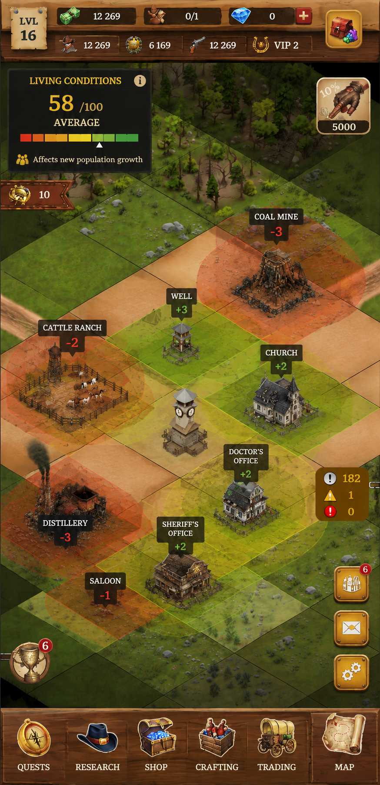

## Koncept

Rozmiestnenie budov nemá byť iba estetické. Má priamo ovplyvňovať fungovanie mesta a vytvárať jednoduchú vrstvu urban planningu.

Jednotlivé budovy môžu mať pozitívny alebo negatívny vplyv na svoje okolie.

## Kde

Hlavná osada / Mapa

## Kedy

Po odomknutí základných obytných a výrobných budov, keď hráč začne plánovať rozloženie osady.

## Ako to funguje

Výrobné budovy, napríklad Factory, Mine a Foundry, môžu znižovať Living Conditions v okolí. To môže negatívne ovplyvniť rast populácie, spokojnosť, hodnotu pozemkov a ďalšie štatistiky mesta. Church, Sheriff / Police, Park a Services môžu životné podmienky alebo atraktivitu okolitého územia zvyšovať. Samostatné zobrazenie POLLUTION / LIVING CONDITIONS VIEW ukáže vplyv budov na okolité políčka.

## Ovládanie

OTVORIŤ MAPU → AKTIVOVAŤ POLLUTION / LIVING CONDITIONS VIEW → SKONTROLOVAŤ OKOLIE → UPRAVIŤ ROZLOŽENIE MESTA

## Negatívne vplyvy

Priemyselné a výrobné budovy, napríklad:

- Factory
- Mine
- Foundry
- ďalšie výrobné budovy

môžu znižovať Living Conditions v okolí.

To môže negatívne ovplyvňovať:

- rast populácie (Population Growth)
- spokojnosť (Happiness)
- hodnotu pozemkov (Land Value)
- prípadne ďalšie štatistiky mesta (City Stats)

## Pozitívne vplyvy

Budovy ako:

- Church
- Sheriff / Police
- Park
- Services

môžu Living Conditions alebo atraktivitu okolitého územia zvyšovať.

## Strategický efekt

Systém má prirodzene motivovať hráča vytvárať rozdielne časti mesta.

**INDUSTRIAL ZONE**  
Factories / Mines / Production

vs.

**RESIDENTIAL ZONE**  
Homes / Church / Services

Ak chce hráč maximalizovať rast populácie a kvalitu obytných oblastí, musí premýšľať nad tým, kde umiestni priemyselné budovy.

## Prečo to dáva zmysel

Systém prirodzene motivuje hráča vytvárať rozdielne časti mesta: INDUSTRIAL ZONE pre Factories / Mines / Production a RESIDENTIAL ZONE pre Homes / Church / Services. Ak chce maximalizovať rast populácie a kvalitu obytných oblastí, musí premýšľať, kam umiestni priemyselné budovy.

## Pollution / Living Conditions Overlay

Hra môže obsahovať samostatné tlačidlo:

**POLLUTION / LIVING CONDITIONS VIEW**

Po aktivovaní sa nad mapou zobrazí overlay znázorňujúci vplyv jednotlivých budov na okolité políčka.

Hráč tak okamžite vidí:

- problematické oblasti
- čisté oblasti
- vhodné miesta na bývanie
- dosah priemyslu

## Gameplay Loop

**POSTAVIŤ BUDOVU**  
↓  
**BUDOVA OVPLYVNÍ OKOLIE**  
↓  
**ZMENIA SA LIVING CONDITIONS**  
↓  
**SKONTROLOVAŤ OVERLAY**  
↓  
**UPRAVIŤ ROZLOŽENIE MESTA**

## Wind System – budúce rozšírenie

Neskôr sa môže pridať smer vetra.

Znečistenie by sa potom nešírilo rovnomerne do všetkých strán, ale podľa aktuálneho smeru vetra.

To by vytvorilo ďalšiu vrstvu rozhodovania pri umiestňovaní priemyselných budov.

---

# 19. Odložené / budúce systémy

Tieto systémy momentálne **nie sú prioritou**.

## Hry v Saloone

Neskôr:

**Farkle**

**Faro**

**Blackjack**

**Poker**

## Systém koní

Zatiaľ neriešime:

**Zbieranie koní**

**Rarita koní**

**Chov koní**

**Komplexné štatistiky koní**

## Centrum Native tábora

Samostatný komplexný Native Camp centrum momentálne nevytvárame.

Native Camp môže zatiaľ slúžiť hlavne ako lokácia pre Archery Challenge.

## Synergie budov

Momentálne ich ďalej nerozpracovávame.

---

# 20. Otvorené rozhodnutia

Zatiaľ nie je potrebné riešiť detailne:

* presné payouty Western Dice,
* presné unlock levely,
* presné rewards,
* scoring jednotlivých minihier,
* cooldowny,
* finálne Touch vs. Gyro ovládanie Archery,
* Shooting sensitivity,
* Revolver reload,
* tabuľka koristi pre Gold Panning,
* vyčerpateľnosť miesta na ryžovanie zlata,
* získavanie Dynamite,
* Dynamite Mining loot,
* Horseshoe modifiers,
* Lasso scoring,
* Stretnutia s divými zvieratami,
* Laso z koňa,
* vlastníctvo koní,
* rarita / chov / štatistiky koní,
* bodovanie Horse Riding,
* dĺžku tratí Horse Riding,
* Train Loading timer,
* Train Loading penalties,
* Train capacity,
* cargo prioritization,
* náročnosť Safe Cracking,
* korisť z trezoru,
* frekvenciu plagátov hľadaných,
* systém stôp pri plagátoch hľadaných,
* Wrong Suspect penalties,
* Quick Draw balancing,
* Expedition unlock,
* Expedition zásoby,
* Expedition travel time,
* Expedition failure,
* Expedition rewards,
* ceny v Trading Poste,
* obnovovanie ponúk v Trading Poste,
* limity nákupu a predaja v Trading Poste,
* Špeciálne ponuky,
* počet kovbojov v Combat tíme,
* bojové štatistiky kovbojov,
* triedy / úlohy kovbojov,
* typy nepriateľov,
* poradie útokov,
* Okno na načasovanie kritického útoku,
* Okno na načasovanie obrany,
* Meter špeciálu,
* špeciálne útoky,
* kovboj HP / healing,
* škálovanie náročnosti súboja,
* odmeny za súboj,
* dôsledky porážky,
* detailnú technickú implementáciu.

Tieto veci sa vyriešia až pri detailnom návrhu jednotlivých systémov.

---

# 21. Celková gameplay filozofia

Gold Trail Tycoon kombinuje niekoľko vrstiev gameplayu.

## IDLE / TYCOON

Budovanie osady, výroba, zdroje, crafting a ekonomický progres.

## PRIESKUM

Odhaľovanie mapy, bodov záujmu, táborov banditov, Native Campov, riek a ďalších objavov.

## AKTÍVNY WESTERNOVÝ GAMEPLAY

Krátke tematické minihry a stretnutia.

## COMBAT

kovboji proti banditi s jednoduchým semi-automatic combat systémom a aktívnym načasovaním.

## DOBRODRUŽSTVO

Expedície, plagáty hľadaných, banditi, poklady a ďalšie udalosti vo svete.

## EKONOMIKA

Obchodovanie, správa zdrojov, výroba a progres.

Tieto časti by nemali fungovať izolovane.

Hlavný loop hry:

**POSTAVIŤ → VYRÁBAŤ → ZÍSKAŤ KOVBOJOV → PRESKÚMAŤ → OBJAVIŤ → INTERAGOVAŤ / BOJOVAŤ → ODMENA → OBCHODOVAŤ / UPGRADE → EXPAND**

Aktívne minihry a Combat tak nie sú samostatný **arkádový režim**.

Sú súčasťou westernového sveta, prieskumu a ekonomiky **Gold Trail Tycoon**.
